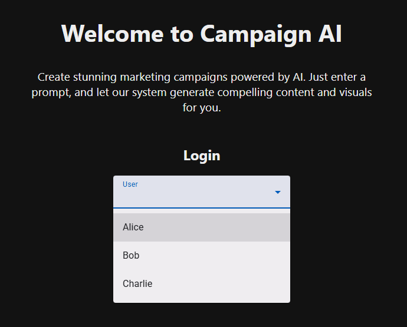
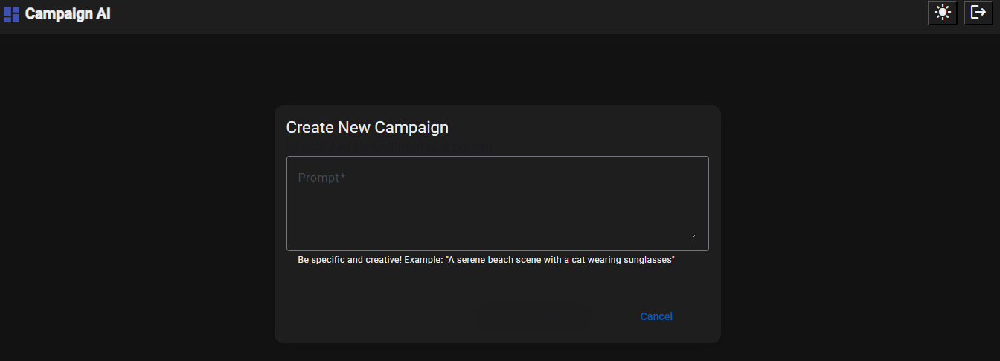
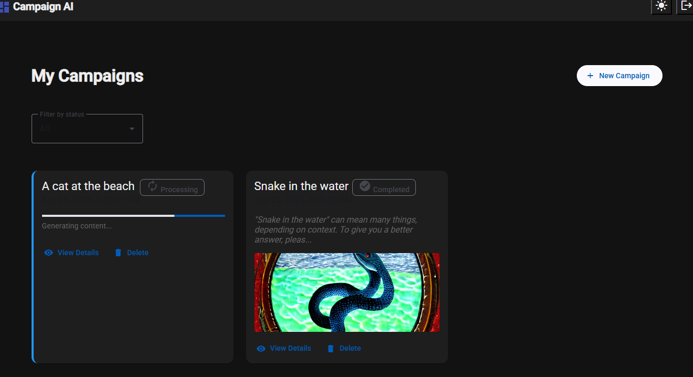
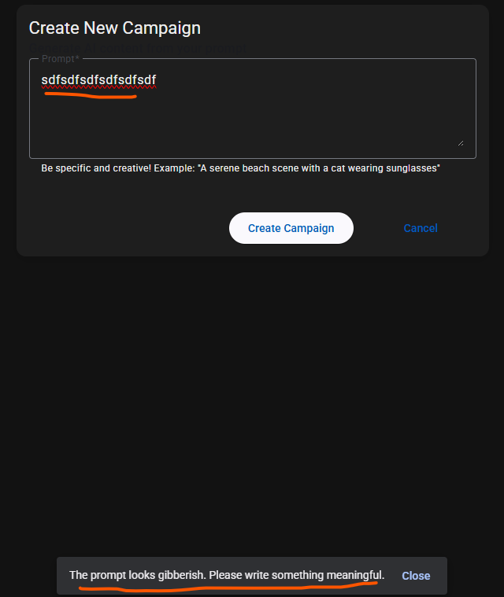

# Mini Solara System PRO-Live (Fullstack Edition)

Welcome to Solara AI's senior fullstack engineering challenge. My task was to build a complete system that generates real text and images from a prompt, featuring a modern Angular frontend, NestJS API layer, and Python AI services.

## System Overview
1. A user creates campaigns through an **Angular web interface**.
2. The frontend sends requests to the **NestJS API** which stores jobs in PostgreSQL.
3. NestJS forwards prompts to the **Python AI service** for processing.
4. The Python service calls **Google Gemini** for text and **Stable Diffusion** for images.
5. Results are returned to NestJS, stored in the database, and displayed in the frontend.
6. Users can view real-time status updates and browse their campaign list.

## Project Structure
• 	angular-frontend/ – Angular 19 app with Angular Material

• 	nestjs-service/ – NestJS backend with TypeORM and PostgreSQL

• 	python-generator/ – Python service that integrates with Gemini for text generation via HTTP

• 	python-worker/ - Python worker that listens to RabbitMQ and handles image generation using Stable Diffusion

• 	docker-compose.fullstack.yml/ – Full stack orchestration

• 	scripts/seed-db.sh – Script to initialize the database

• 	.env.example – Environment template for backend configuration


### Backend Features
• 	RESTful API with endpoints for creating, viewing, and deleting campaigns
• 	Integration with Python service via HTTP
• 	Structured error handling and retries
• 	Image storage and static serving from /output
• 	Campaign status tracking (pending, processing, completed, failed)
• 	RabbitMQ queue for async processing

### Frontend Features
• 	Campaign creation form with gibberish detection and validation
• 	Campaign dashboard with filters, status indicators, and previews
• 	Campaign detail view with full content and metadata
• 	Retry and delete actions for failed campaigns
• 	Responsive design with Angular Material
• 	Auto-refresh for live status updates

### Python Service
- Receives prompt and campaign metadata from NestJS
- Calls Gemini API for text generation
- Calls Stable Diffusion for image generation
- Returns results to NestJS
- Logs job status and errors


## Setup Instructions

### Backend Setup
- Copy the environment template and fill in your Gemini API key:
```bash
cp .env.example .env
```
- Open the .env file and insert your own Gemini API key in the GEMINI_API_KEY field.
You must obtain a valid key from Google AI to enable text generation.

- Start the backend services:
```bash
docker-compose up --build
```

### Frontend Setup
Create and set up the Angular application:
```bash
cd angular-frontend
npm install
ng serve
   ```
Make sure to configure proxy for API requests to http://localhost:3000


### Running the Full Stack

##### Option 1: Fullstack Docker Compose (recommended for quick setup)
```bash
cd candidate
docker compose -f docker-compose.fullstack.yml build
docker compose -f docker-compose.fullstack.yml up
```

#### Option 2: Separate Terminals (for development flexibility)
Terminal 1 – Backend + Database + Python worker:

```bash
cd candidate
docker compose -f docker-compose.yml build
docker compose -f docker-compose.yml up
```
Terminal 2 – Frontend (Angular):

```bash
cd angular-frontend
npm install
ng serve
   ```
   
- Backend API: `http://localhost:3000`
- Frontend App: `http://localhost:4200` (default Angular dev server)


## API Endpoints

### Core Endpoints
#### `POST /campaigns`
Enqueue a new campaign generation request.
```json
{
  "prompt": "Create a beach scene with a cat"
}
```

#### `GET /campaigns/:id`
Fetch the current status and generated results for a campaign.

#### `GET /campaigns`
List all campaigns for a user.

### Additional Endpoints (Required for Frontend)
#### `GET /campaigns/:id/status`
Get campaign status.

#### `DELETE /campaigns/:id`
Delete campaign.

## Screenshots






## Design Decisions
- Used Angular Material for fast UI scaffolding
- Chose RabbitMQ for decoupled async processing
- Implemented gibberish detection to improve prompt quality
- Avoided WebSocket for simplicity, used polling instead

